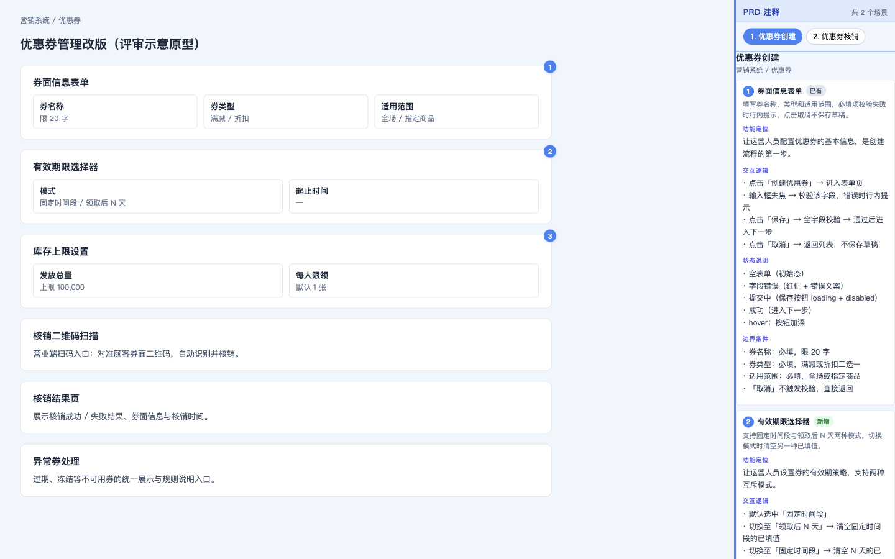
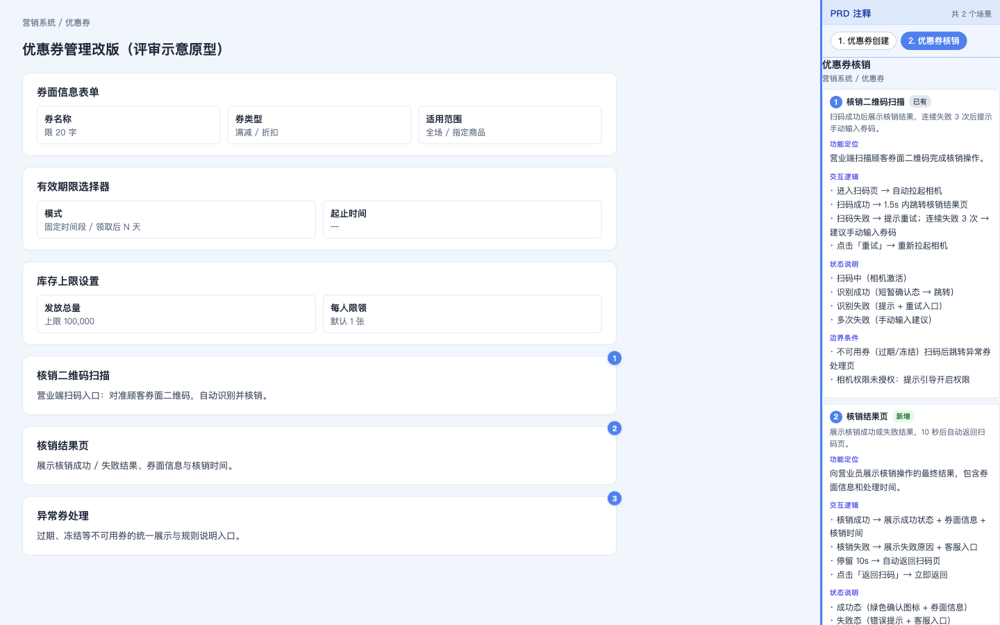

# spec-analyze

**产品经理工作伴侣——按 PM 实际处境提供帮助，从需求理解到研发交付全程覆盖。**

spec-analyze 是一个 AI 代理 skill，识别 PM 当前的工作处境，路由到对应的模式执行。五种工作模式：理解问题 / 挑战需求 / 设计方案 / 规格化与交付 / 做决策。

当前版本：**v5.0.0**（完整变更见 [CHANGELOG.md](CHANGELOG.md)）。

---

## 快速开始

```bash
# 克隆仓库
git clone https://github.com/SWUNwy/spec-analyze.git
cd spec-analyze

# 打开评审注释演示
open demo/demo.html
```

演示页展示优惠券管理改版评审原型：左侧产品原型组件带编号徽标锚点，右侧「PRD 注释」面板展示 PM 6字段注释（功能定位/交互逻辑/状态说明/边界条件），悬停左侧组件右侧自动高亮滚动，点击右侧注释左侧原型跳转到对应组件：





---

## 五种工作模式

### 模式一：理解问题

**处境**：拿到一个需求/反馈/指令，不确定它真正在说什么。

**触发**：「分析这个需求」「理解需求」「梳理一下」「用户反馈了X」「老板说要做X」

**输出**：清晰版问题陈述 + 关键未知项 + 建议下一步

---

### 模式二：挑战需求

**处境**：对某个需求有疑虑，想找出问题、识别风险假设、准备推回去的论据。

**触发**：「这个需求靠谱吗」「帮我找漏洞」「我想推回去」「值得做吗」「需求反问」

**输出**：

```
## 假设地图
1. [假设] → 如果不成立：[后果]

## 挑战问题
1. [可以直接拿去问需求提出方的尖锐问题]

## 裁定
推进 / 先验证X再决定 / 推回去 — [一句话理由]
```

---

### 模式三：设计方案

**处境**：问题清楚，决定要解决，需要找到最佳解法。

**触发**：「怎么做这个功能」「帮我设计」「产品方案」「几个方向想比」

**输出**：2-3 个方向对比（核心差异/前提/风险）+ 推荐 + 推翻条件

---

### 模式四：规格化与交付

**处境**：方案已定，需要写文档或准备评审材料。三个子模式：

| 子模式 | 触发 | 输出 |
|--------|------|------|
| **4A 原型注释** | 「原型注释」「交互注释」「给设计稿标注」 | HTML 评审注释面板（编号徽标 + PM 6字段） |
| **4B PRD 撰写** | 「写PRD」「整理文档」「研发需要文档」 | 标准 PRD 文档 |
| **4C Spec 三文档** | 「写规格」「研发评审文档」「Spec」 | proposal + design + tasks |

**PM 注释内容边界**（硬约束，不出现）：API路径、HTTP状态码、CSS像素值、timing参数、aria属性、i18n key

---

### 模式五：做决策

**处境**：面对明确的选择——要不要做、哪个方案、怎么排优先级。

**触发**：「怎么选」「要不要做」「优先级怎么排」「A还是B」

**输出**：推荐 + 最影响结论的核心变量 + 推翻条件 + 可选决策记录

---

## 模式衔接

模式之间自然衔接，每个模式结束时主动提示下一步：

```
理解问题 → 挑战需求（发现有问题）/ 设计方案（问题清楚了）
挑战需求 → 做决策（要不要做）/ 设计方案（决定推进）
设计方案 → 规格化与交付（方案确定）/ 做决策（多方向难选）
```

---

## 目录结构

```
spec-analyze/
├── SKILL.md                    # 主入口：五模式路由与执行协议
├── demo/
│   ├── demo.html               # 可视化演示（无 SVG 连线，编号徽标 + 滚动联动）
│   ├── screenshot-1.png        # 演示截图：优惠券创建场景
│   └── screenshot-2.png        # 演示截图：优惠券核销场景
└── references/
    ├── annotation-output-templates.md   # 权威 HTML 模板 + v4.0 JS + PM schema
    ├── annotation-example.md            # PM 注释示例（6字段格式 + 禁止内容清单）
    ├── annotation-templates.md          # T1-T11 组件类型模板（工程交接路径）
    ├── delivery-contract.json           # 字段层级：PM/Implementation/Acceptance
    ├── html-annotation-system.md        # 徽标锚定系统 + 双向高亮协议
    ├── personas.md                      # 5个专家角色（按模式意图选用）
    ├── intake-audit.md                  # 六维度检查工具（模式一使用）
    ├── adversarial-review.md            # 对抗审查协议（模式二 + 4C使用）
    ├── divergence-frameworks.md         # 18个发散框架（模式三使用）
    ├── decision-log-format.md           # 决策记录格式（模式五使用）
    ├── prd-output-template.md           # PRD 模板（模式四 4B使用）
    ├── spec-templates.md                # Spec 三文档模板（模式四 4C使用）
    ├── pmframe-index.md                 # 100个PM思维模型索引（10领域）
    └── chinese-writing-style.md         # 中文写作规范
```

---

## 版本

- **v5.0.0**：架构重构——复杂度三路径改为 PM 处境五模式；新增挑战需求（模式二）和做决策（模式五）；意图识别路由替代关键词匹配
- **v4.0.0**：注释系统重构——移除 SVG 连线改用编号徽标；注释 schema 从 L1/L2/L3 改为 PM 6字段；delivery-contract.json 字段层级修正
- **v3.x**：原规格驱动开发分析引擎（Lightweight/Standard/Full 路径）

完整变更见 [CHANGELOG.md](CHANGELOG.md)。
